

Project Phase 2: OO Analysis and Design ITCS431 Software Design and Development  Present to  

Asst. Prof. Dr. Morakot Choetkiertikul  Dr. Chaiyong Ragkhitwetsagul 

Compose by  

6588057 Nantipat Maneerattanaporn 6588079 Poottapol Poonna  
6588122 Weixian Deng  

6588188 Yotsapat Rattanaprasert  

Semester 2 of the academic year 2023  
Faculty of Information and Communication Technology  Mahidol University 

**Login**  

**Use case description** 

|**Use Case Name:** Login |**ID**: U001 |**Importance Level:** High ||
| - | - | - | :- |
|**Primary Actor:** Any system user (e.g., Astronomer, Science Observer, Telescope Operator, Support, Developer, Administrator) |**Use Case Type:** Essential |||
|
**Stakeholders and Interests:** 

- **System Users:** Need access to the system according to their privileges. 

- **System Administrator:** Ensures only authorized users gain access. 

- **Gemini System:** Maintains security and operational integrity. 
||||
|
**Brief Description:** 

The use case describes the process by which users authenticate themselves into the Gemini system. Users enter their credentials, and the system verifies their identity before granting access to specific functionalities based on their role. 
||||
|
**Trigger:** 

A user wants to access the system to perform their respective tasks. 

**Type:** User-initiated 
||||
|
**Relationships:** 

**Association: User 

 Include: -  

 Extend: -  

 Generalization: -**  
||||

|
**Normal Flow of Events:** 

1. The user navigates to the login page. 

2. The system prompts for a username and password. 

3. The user enters their credentials and submits the form. 

4. The system verifies the credentials against the user database. 

5. the system determines the user's role and associated permissions. 

6. The system grants access and redirects the user to the appropriate dashboard. 
|
| - |
|
**Subflows:** 

- If the user has multiple roles, the system may prompt them to select an active role for the session. 

- If the user has multi-factor authentication enabled, they must complete an additional verification step. 
|
|
**Alternate/Exceptional Flow:** 

1. If the credentials are incorrect, the system displays an error message and prompts the user to try again. 

2. If the user fails multiple attempts, the system locks the account temporarily. 

3. If the system is under maintenance, the login attempt is denied with a maintenance notification. 

4. If the user’s role is restricted from logging in at the current operational level, access is denied with a message. 
|

**Activity Diagram**  

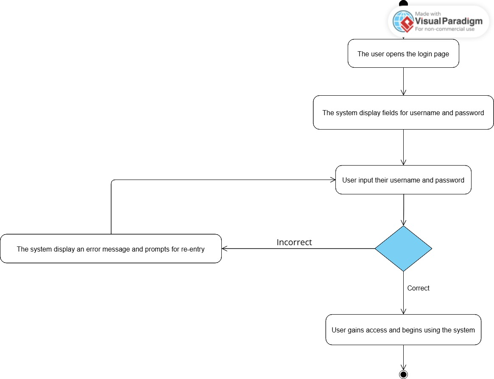

**Sequence Diagram**   

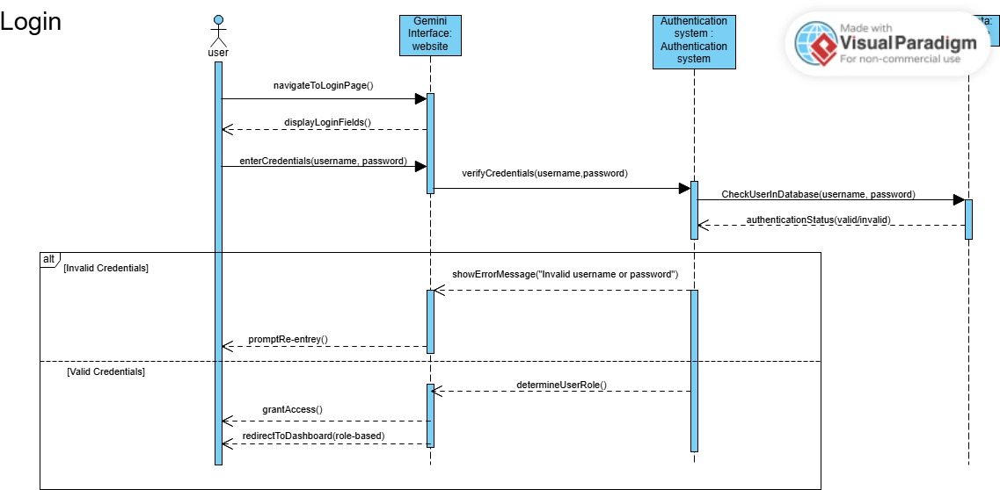

**Create a science plan  Use case description**  

|**Use Case Name:** Create a Science Plan |**ID**: U002 |**Importance Level:** High ||
| :- | - | - | :- |
|**Primary Actor:** Astronomer |**Use Case Type:** Essential |||
|
**Stakeholders and Interests:** 

- **Astronomer:** Needs to create a science plan for observations. 

- **Science Observer:** Uses the plan to validate and transform it into an observing program. 

- **Gemini System:** Ensures science plans are properly formatted and executable.** 
||||
|
**Brief Description:** 

This use case describes the process where an astronomer creates a science plan by specifying observation targets, instruments, and settings. The plan must meet system constraints and is submitted for validation before execution.** 
||||
|
**Trigger:** 

An astronomer wants to propose an observation by creating a science plan in the system. 

**Type:** User-initiated 
||||
|
**Relationships:** 

**Association:** Astronomer 

**Include: -** 

**Extend: - 

Generalization: -**  
||||

|
**Normal Flow of Events:** 

1. The astronomer logs in to the Gemini website.  

2. The astronomer accesses the science planning interface. 

3. The system provides a form or tool to input observation details. 

4. The astronomer specifies the target celestial objects. 

5. The system allows the astronomer to review and edit the plan. 

6. The astronomer checks if it is satisfied, and they submit the plan for validation. 

7. The astronomer goes back to reviewing and editing the plan. 

8. The astronomer submits the plan for validation. 

9. The system stores the plan and notifies the Science Observer for review. 
|
| - |
|
**Subflows:** 

- The astronomer can test the science plan using the virtual telescope before submission. 

- The astronomer can save a draft and continue editing later. 
|
|
**Alternate/Exceptional Flow:** 

1. If required fields are missing, the system prompts the astronomer to complete them. 

2. If instrument selection is incompatible, the system suggests alternatives. 

3. If scheduling conflicts arise, the system provides an alert and alternative options. 

4. If the network connection is lost, the system saves the draft for later submission. 
|

**Activity Diagram**  

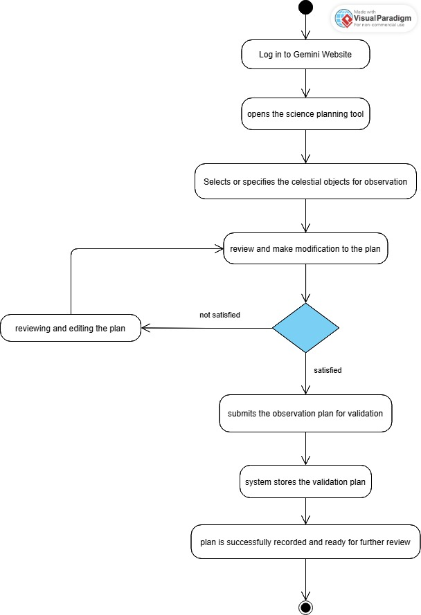

**Sequence Diagram**   

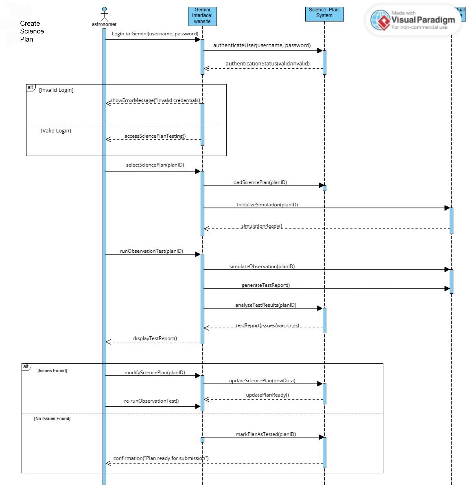

**Test a science plan  Use case description**  

|**Use Case Name:** Test a science plan |**ID**: U003 |**Importance Level:** High ||
| :- | - | - | :- |
|**Primary Actor:** Astronomer  |**Use Case Type:**  Detail, Essential |||

|
**Stakeholders and Interests:** 

- **Astronomer:** Needs to verify the feasibility of the science plan before submission. 

- **Science Observer:** Ensures that the plan meets observation requirements. 

- **Gemini System:** Provides a simulation environment to check for potential issues.** 
|
| - |
|
**Brief Description:** 

This use case describes how an astronomer tests a science plan using the virtual telescope or interactive observing mode to verify its feasibility before submission. The test helps detect issues related to target visibility, instrument configuration, and environmental conditions. 
|
|
**Trigger:** 

An astronomer wants to verify the correctness of a science plan before submitting it. 

**Type:** User-initiated** 
|
|
**Relationships:** 

**Association:** Astronomer**  

**Include:** Login, Simulate Observation, Validate Target Visibility, Check Instrument Compatibility** 

**Extend: -** 

**Generalization: -**  
|
|
**Normal Flow of Events:** 

1. The astronomer logs in to the Gemini website.  

2. The astronomer selects a science plan to test. 

3. The system loads the science plan and initializes the virtual telescope. 

4. The system simulates the observation. 

5. The system generates a test report with potential issues or warnings. 

6. The astronomer reviews the report and makes necessary adjustments. 

7. The astronomer either fixes issues and re-tests the plan or submits the tested plan for validation. 
|

|
**Subflows:** 

- If no major issues are detected, the system marks the plan as "Tested" for submission. 

- The astronomer can adjust parameters and re-run the test multiple times. 
|
| - |
|
**Alternate/Exceptional Flow:** 

1. If the target is not visible during the selected time, the system suggests alternative timings. 

2. If the selected instrument is unavailable, the system recommends compatible options. 

3. If weather conditions are unsuitable, the system alerts the astronomer with predicted conditions. 

4. If system resources are overloaded, the test is queued, and the astronomer is notified when it is completed. 
|

**Activity Diagram**   

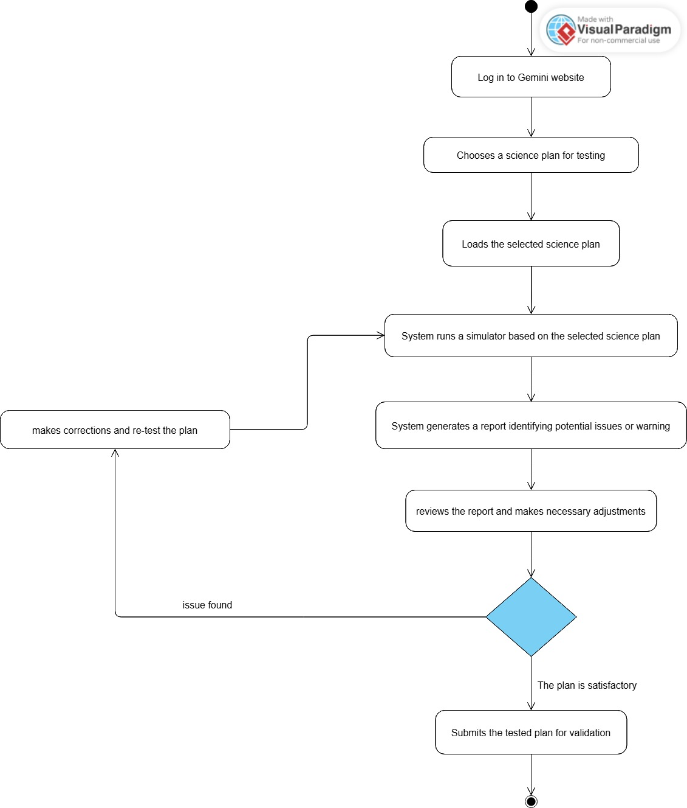

**Sequence Diagram**   

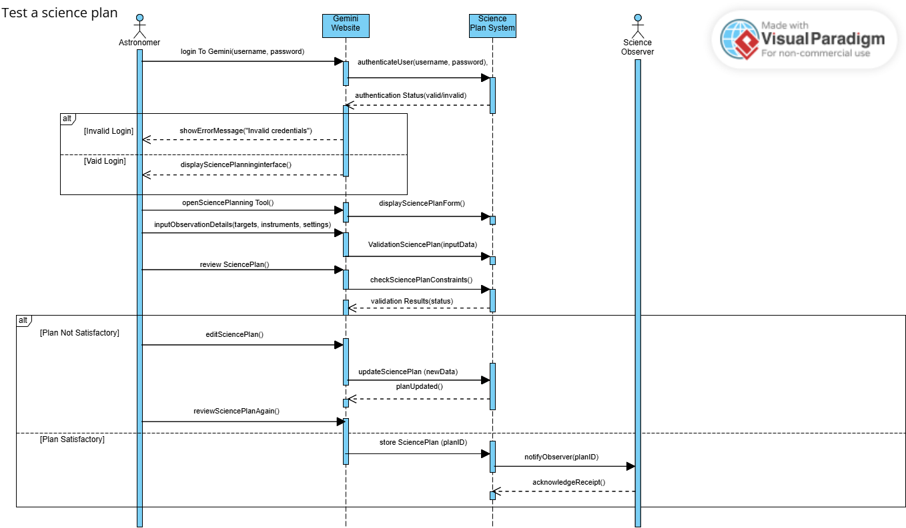

**Manage astronomical data**  

**Use case description** 

|**Use Case Name:** Manage astronomical data  |**ID**: U004 |**Importance Level:** High ||
| :- | - | - | :- |
|**Primary Actor: Science Observer** |**Use Case Type: Detail,** Essential  |||
|
**Stakeholders and Interests:** 

- **Astronomer:** Needs to access, analyze, and manage collected data. 

- **Science Observer:** Ensures data integrity and assists with validation. 

- **Gemini System:** Stores, organizes, and secures astronomical data for research and future access. 
||||
|
**Brief Description:** 

This use case describes how an astronomer accesses, processes, validates, and organizes collected astronomical data after an observation session. The data must be securely stored and made available for further analysis.** 
||||
|
**Trigger:** 

An astronomer wants to review, validate, or archive astronomical data after an observation session. 

**Type:** User-initiated** 
||||
|
**Relationships:** 

**Association: Science Observer 

Include: -** 

**Extend: -** 

**Generalization: -**  
||||

|
**Normal Flow of Events:** 

1. The astronomer logs into the system and navigates to the data management interface. 

2. The system displays available astronomical data, including metadata such as observation date and instrument settings. 

3. The astronomer selects a dataset to review. 

4. The system provides visualization tools to inspect and analyze the data. 

5. The astronomer validates data integrity by checking for missing or corrupted data, annotates or adds comments for further analysis, and filters and organizes data based on observation details. 

6. The astronomer chooses to either download the data for offline analysis or archive the data in the Gemini system for future access. 

7. The system confirms the action and updates the data status. 
|
| - |
|
**Subflows:**   

- If needed, the astronomer can **apply basic image processing** to enhance data quality. 

- The system can **automatically archive** validated data in the Gemini Archive subsystem.** 
|
|
**Alternate/Exceptional Flow:** 

1. If the data is corrupted or incomplete, the system alerts the astronomer and suggests recovery options. 

2. If network issues occur, the system allows offline mode for later synchronization. 

3. If storage space is insufficient, the system prompts the astronomer to manage existing archives. 
|

**Activity Diagram**   
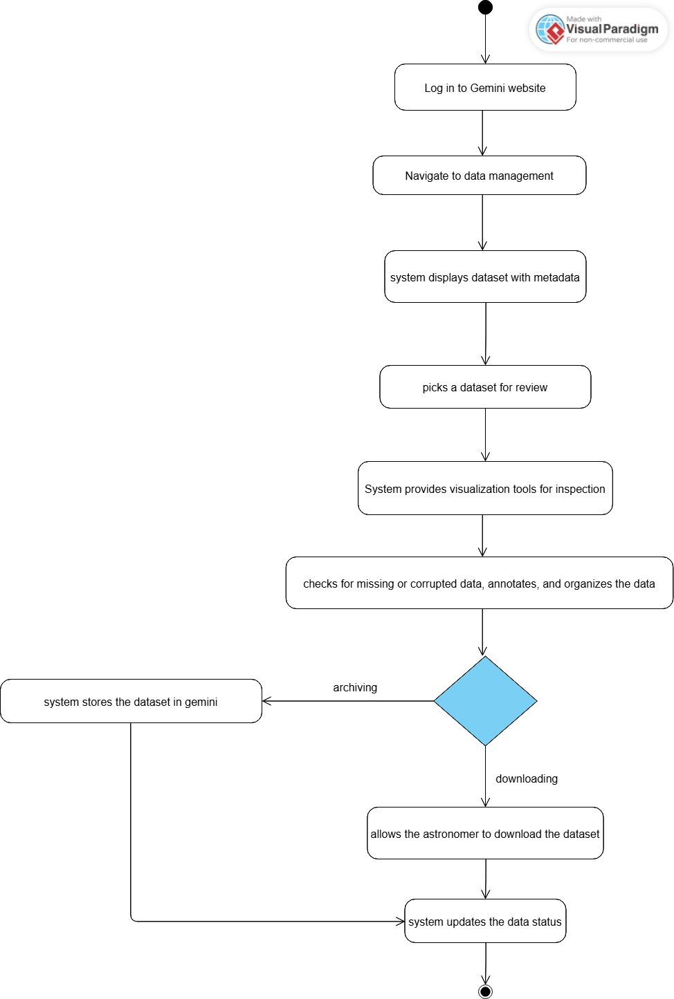

**Sequence Diagram**   
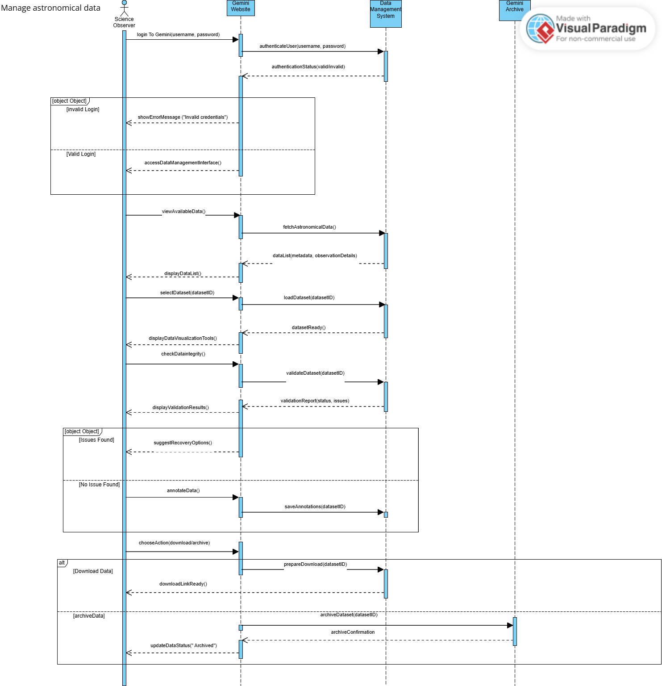

**Submit a Science Plan Use case description**

|**Use Case Name:** Submit a Science Plan |**ID**: U005 |**Importance Level:** High ||
| :- | - | - | :- |
|**Primary Actor:** Astronomer |**Use Case Type:** Essential  |||
|
**Stakeholders and Interests:** 

- **Astronomer:** Needs to submit a completed science plan for validation and execution. 

- **Science Observer:** Reviews and validates the plan before transforming it into an observing program. 

- **Gemini System:** Ensures submitted plans meet scientific and operational requirements. 
||||
|
**Brief Description:** 

This use case describes how an astronomer submits a completed science plan for validation and further processing. The system checks for completeness and sends the plan to the Science Observer for review. 
||||
|
**Trigger:** 

An astronomer wants to finalize and submit a science plan for validation. 

**Type:** User-initiated** 
||||
|
**Relationships:** 

**Association:** Astronomer 

**Include: -**  

**Extend: -  

Generalization: -**  
||||

|
**Normal Flow of Events:**

1. The astronomer logs in to the Gemini website.  

2. The astronomer accesses the science planning interface. 

3. The system displays a list of saved science plans. 

4. The astronomer selects a plan to submit. 

5. The system performs basic validation, including checking for missing or incomplete fields, ensuring required instruments are available, and verifying target visibility and scheduling feasibility. 

6. The astronomer confirms submission. 

7. The system assigns a status, such as "Pending Validation." 

8. The system notifies the Science Observer for further review. 
|
| - |
|
**Subflows:** 

- The astronomer can add final comments or notes before submission. 

- The system can suggest minor corrections before finalizing submission. 
|
|
**Alternate/Exceptional Flow:**   

1. If required fields are missing, the system prompts the astronomer to complete them. 

2. If the selected instrument is unavailable, the system suggests alternatives. 

3. If the submission fails due to network issues, the system saves a draft for later submission. 

4. If the Science Observer rejects the plan, it is returned to the astronomer for modifications. 
|

**Activity Diagram**   

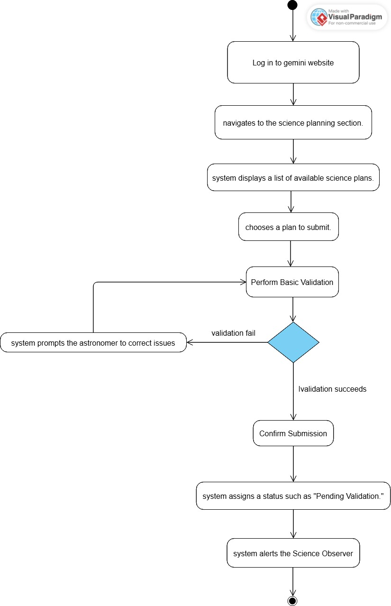

**Sequence Diagram**   

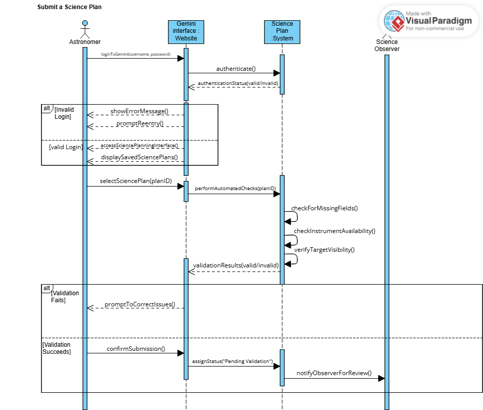

**Validate a Science Plan Use case description** 

|**Use Case Name:** Validate a Science Plan |**ID**: U006 |**Importance Level:** High ||
| :- | - | - | :- |
|**Primary Actor:** Science Observer |**Use Case Type:** Essential  |||
|
**Stakeholders and Interests:** 

- **Science Observer**: Ensures the science plan meets scientific and technical requirements. 

- **Astronomer**: Needs confirmation that the science plan is valid and executable. 

- **Gemini System**: Maintains the integrity of submitted science plans and ensures compatibility with operational constraints.** 
||||
|
**Brief Description:** 

This use case describes how a Science Observer reviews and validates a submitted science plan to ensure it meets observational constraints, instrument configurations, and scheduling feasibility before it is transformed into an observing program.** 
||||
|
**Trigger:** 

A science plan is submitted and needs validation before execution. 

**Type:** User-initiated 
||||
|
**Relationships:** 

**Association:** Science Observer 

**Include: -**  

**Extend: -**  

**Generalization: -**  
||||

|
**Normal Flow of Events** 

1. The astronomer logs in to the Gemini website.  

2. The Science Observer accesses the science plan review interface. 

3. The system presents a list of submitted science plans. 

4. The observer selects a plan for validation. 

5. The system performs automated checks. 

6. The observer reviews the system’s validation results and performs manual checks for additional issues. 

7. The observer decides to either between Approve the plan for execution and Request modifications from the astronomer. 

8. System transforms the approved science plan into an observing program. 
|
| - |
|
**Subflows:** 

- If minor issues are detected, the observer can suggest corrections rather than rejecting the plan. 

- The observer can prioritize certain plans based on scientific importance or scheduling availability. 
|
|
**Alternate/Exceptional Flow:** 

1. If the science plan is incomplete, the system marks it as "Requires Revision" and sends feedback to the astronomer. 

2. If instrument availability changes, the observer can propose alternative configurations. 

3. If there are scheduling conflicts, the system suggests adjustments or alternative time slots. 
|

**Activity Diagram**   

**Sequence Diagram**   

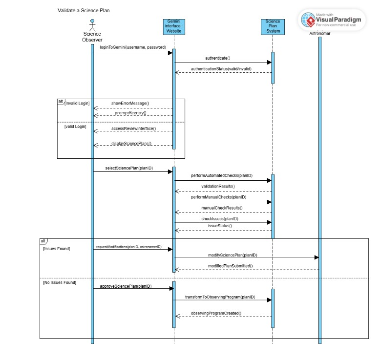

Class diagram

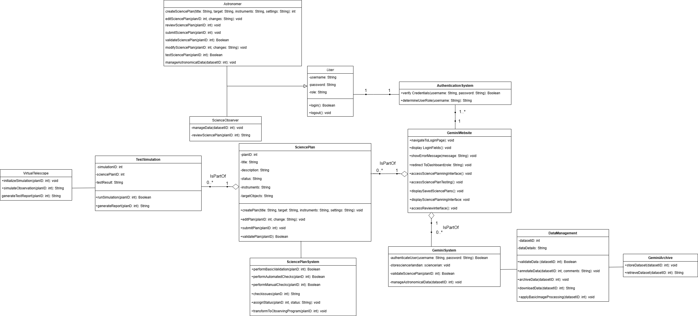

